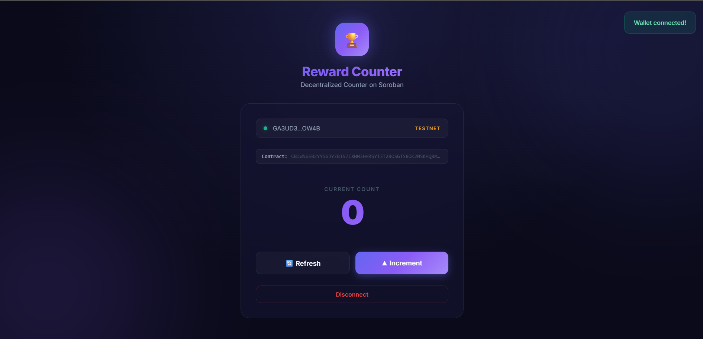
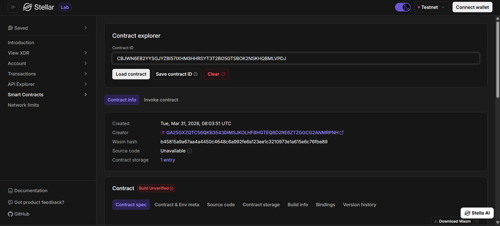

# 🏆 Reward Counter — Stellar Soroban DApp

A premium, decentralized Reward Counter application built on the **Stellar Soroban** blockchain. This dApp allows users to connect their Freighter wallet and securely increment a global counter on the blockchain.

## 🔗 Live Implementation
*   **Contract ID:** `CBJWN6EB2YYSGJYZBI57IXHM3HHRSYT3T2BO5GTSBOK2NSKHQBMLVPDJ`
*   **Network:** Stellar Testnet
*   **RPC Endpoint:** `https://soroban-testnet.stellar.org`

## 🕹️ Dashboard Preview
The Reward Counter features a high-fidelity glassmorphism UI with real-time blockchain synchronization.



## 🏗️ Stellar Laboratory Integration
Directly interact with and verify your contract state using the Stellar Laboratory.



## ✨ Features
-   **Modern React UI**: Built with React 19 and Vite for lightning-fast performance.
*   **Premium Design**: Sleek glassmorphism theme, smooth animations, and toast notifications.
*   **Non-Custodial**: Connect safely using the [Freighter Browser Extension](https://www.freighter.app/).
*   **Auto-Funding**: Automatically detects new accounts and funds them via Friendbot on Testnet.
*   **Robust TX Handling**: Uses `prepareTransaction` for reliable simulation and assembly.

## 🏗️ Project Structure
```text
reward-counter/
├── contracts/          # Rust Smart Contracts (Soroban)
│   └── reward-counter/
├── frontend/           # Modern React + Vite Application
│   ├── src/            # UI Components & Blockchain Logic
│   └── .env            # Environment Configuration
└── README.md           # Documentation
```

## 🚀 Getting Started

### Prerequisites
- [Node.js](https://nodejs.org/) (v18+)
- [Freighter Wallet](https://www.freighter.app/) (Set to **Test Net**)

### 1. Setup Frontend
Navigate to the frontend directory and install dependencies:
```bash
cd frontend
npm install
```

### 2. Configure Environment
Create a `.env` file in the `frontend` folder (one is provided for you):
```env
VITE_CONTRACT_ID=CBJWN6EB2YYSGJYZBI57IXHM3HHRSYT3T2BO5GTSBOK2NSKHQBMLVPDJ
VITE_RPC_URL=https://soroban-testnet.stellar.org
```

### 3. Run Locally
Start the development server:
```bash
npm run dev
```
Open [http://localhost:3000](http://localhost:3000).

## 🛠️ Smart Contract Logic
The contract exposes two main functions:
1. `get_count`: Returns the current global counter value.
2. `increment`: Increases the counter by 1 in the blockchain state.

---
Built with ❤️ by the Reward Counter Team.
